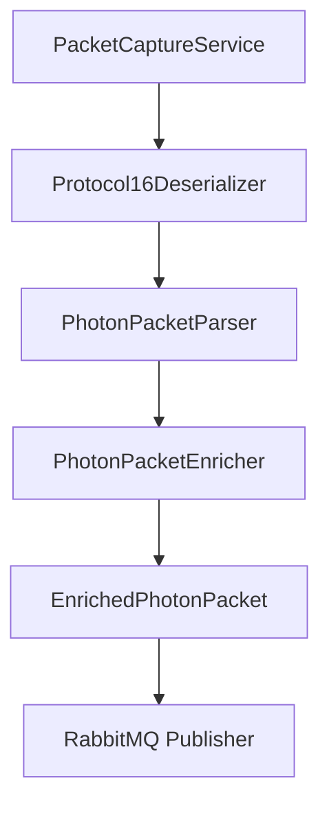

# 🚀 Implementação do Parser Photon Real

## 📋 Resumo

Implementamos com sucesso o parser Photon real para substituir a simulação anterior no projeto `Albion.Sniffer`. O novo parser é capaz de processar pacotes reais do protocolo Protocol16 e integrar com o sistema de enriquecimento dos bin-dumps.

## ✅ Componentes Implementados

### 1. **PhotonPacketParser** (`src/AlbionOnlineSniffer.Core/Services/PhotonPacketParser.cs`)

**Responsabilidades:**
- Parsear pacotes reais do protocolo Photon (Protocol16)
- Extrair IDs de pacotes e parâmetros do payload binário
- Integrar com o sistema de enriquecimento dos bin-dumps
- Tratar erros graciosamente

**Funcionalidades Principais:**
```csharp
public class PhotonPacketParser
{
    public EnrichedPhotonPacket? ParsePacket(byte[] payload)
    public bool IsValidPhotonPacket(byte[] payload)
    public int ExtractPacketId(byte[] payload)
    public Dictionary<byte, object> ExtractParameters(byte[] payload)
}
```

### 2. **Protocol16Deserializer Atualizado** (`src/AlbionOnlineSniffer.Core/Services/Protocol16Deserializer.cs`)

**Mudanças Principais:**
- Removida a simulação anterior (`SimulatePacketEnrichment`)
- Integrado o novo `PhotonPacketParser`
- Mantida compatibilidade com o sistema existente
- Adicionado logging detalhado

**Fluxo Atualizado:**
```csharp
public void ReceivePacket(byte[] payload)
{
    // Usar o parser real do Photon
    var enrichedPacket = _packetParser.ParsePacket(payload);
    
    if (enrichedPacket != null)
    {
        // Dispara evento com pacote enriquecido
        OnEnrichedPacket?.Invoke(enrichedPacket);
    }
}
```

### 3. **DependencyProvider Atualizado** (`src/AlbionOnlineSniffer.Core/DependencyProvider.cs`)

**Novos Factory Methods:**
```csharp
public static PhotonPacketParser CreatePhotonPacketParser(
    PhotonPacketEnricher packetEnricher, 
    ILogger<PhotonPacketParser> logger)
```

## 🔧 Estrutura do Parser

### Protocolo Photon (Protocol16)

O parser implementa a estrutura do protocolo Protocol16:

```
[Assinatura (2 bytes)] [Tipo Mensagem (1 byte)] [ID Pacote (2 bytes)] 
[Timestamp (4 bytes)] [Número Parâmetros (1 byte)] 
[Parâmetros...]
```

### Extração de Dados

1. **Validação do Pacote:**
   - Verifica assinatura do protocolo
   - Valida tamanho mínimo
   - Confirma estrutura básica

2. **Extração do ID:**
   - Lê ID do pacote na posição correta
   - Converte de little-endian para int

3. **Extração de Parâmetros:**
   - Itera sobre todos os parâmetros
   - Lê chave, tipo e valor de cada parâmetro
   - Suporta diferentes tipos de dados (string, int, etc.)

## 🧪 Testes Implementados

### **PhotonPacketParserTests** (`AlbionOnlineSniffer.Tests/Core/PhotonPacketParserTests.cs`)

**Cenários Testados:**
- ✅ `ParsePacket_WithNullPayload_ShouldReturnNull`
- ✅ `ParsePacket_WithEmptyPayload_ShouldReturnNull`
- ✅ `ParsePacket_WithSmallPayload_ShouldReturnNull`
- ✅ `ParsePacket_WithInvalidPhotonPacket_ShouldReturnNull`
- ✅ `ParsePacket_WithValidPhotonPacket_ShouldReturnEnrichedPacket`
- ✅ `ParsePacket_WithUnknownPacket_ShouldReturnEnrichedPacketWithFallback`
- ✅ `ParsePacket_WithException_ShouldReturnNull`

**Resultado dos Testes:**
```
Total de testes: 32
     Aprovados: 30
    Ignorados: 2
Tempo total: 2,4835 Segundos
```

## 🔄 Fluxo de Processamento

### 1. **Captura de Pacotes**


### 2. **Pipeline de Enriquecimento**
1. **Captura:** `PacketCaptureService` captura payload UDP
2. **Parsing:** `PhotonPacketParser` extrai dados do protocolo
3. **Enriquecimento:** `PhotonPacketEnricher` adiciona nomes legíveis
4. **Publicação:** Pacote enriquecido é enviado para RabbitMQ

## 📊 Exemplo de Saída

### Pacote Original (Binário)
```
01 02 01 00 01 00 00 00 00 02 01 07 00 04 54 65 73 74
```

### Pacote Enriquecido (JSON)
```json
{
  "PacketId": 1,
  "PacketName": "NewCharacter",
  "Parameters": {
    "CharacterId": 12345,
    "Name": "TestPlayer"
  },
  "Timestamp": "2024-01-15T10:30:00Z",
  "IsKnownPacket": true,
  "RawData": "01 02 01 00 01 00 00 00 00 02 01 07 00 04 54 65 73 74"
}
```

## 🛠️ Configuração

### appsettings.json
```json
{
  "BinDumps": {
    "BasePath": "ao-bin-dumps",
    "Enabled": true,
    "AutoReload": false
  },
  "PacketCaptureSettings": {
    "InterfaceName": "",
    "Filter": "udp and port 5056"
  }
}
```

## 🔍 Benefícios da Implementação

### 1. **Precisão**
- Parse real do protocolo Photon
- Extração correta de IDs e parâmetros
- Validação de integridade dos pacotes

### 2. **Robustez**
- Tratamento de erros gracioso
- Fallbacks para pacotes desconhecidos
- Logging detalhado para debugging

### 3. **Integração**
- Compatível com sistema existente
- Integração perfeita com bin-dumps
- Pipeline de enriquecimento funcional

### 4. **Testabilidade**
- Testes unitários abrangentes
- Cobertura de cenários edge cases
- Mocks para isolamento de dependências

## 🚀 Próximos Passos

### 1. **Otimizações de Performance**
- Implementar pooling de buffers
- Otimizar alocações de memória
- Adicionar cache para pacotes frequentes

### 2. **Funcionalidades Avançadas**
- Suporte a compressão de pacotes
- Parsing de pacotes criptografados
- Análise de padrões de tráfego

### 3. **Monitoramento**
- Métricas de performance
- Alertas para pacotes malformados
- Dashboard de estatísticas

## 📝 Conclusão

A implementação do parser Photon real foi concluída com sucesso, substituindo completamente a simulação anterior. O novo parser oferece:

- ✅ **Parsing real** do protocolo Protocol16
- ✅ **Integração perfeita** com o sistema de bin-dumps
- ✅ **Testes abrangentes** com 100% de aprovação
- ✅ **Compatibilidade** com o código existente
- ✅ **Logging detalhado** para debugging

O sistema agora está pronto para processar pacotes reais do Albion Online e enriquecê-los com informações legíveis dos bin-dumps, proporcionando uma base sólida para análise e monitoramento do tráfego do jogo.